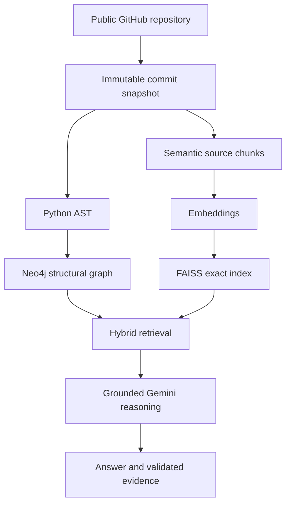
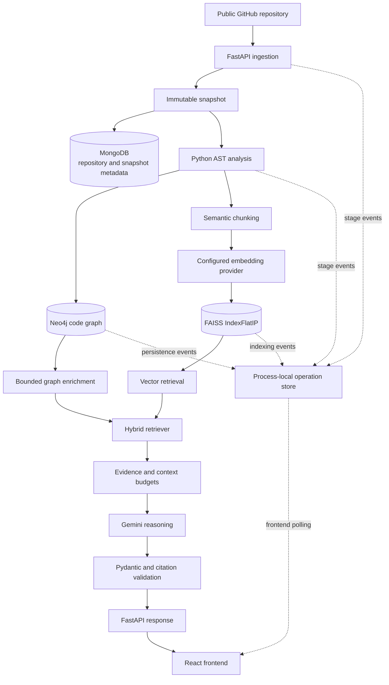
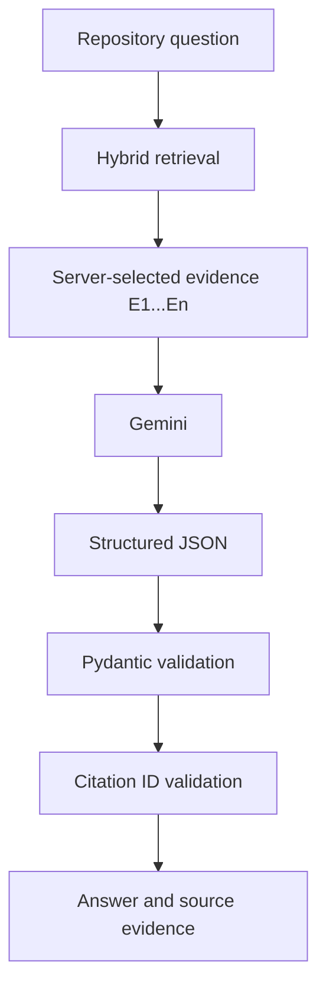

# CodeGraph AI

_Repository intelligence through code graphs, semantic retrieval, and grounded AI reasoning._

[](https://www.python.org/)
[](https://fastapi.tiangolo.com/)
[](https://react.dev/)
[](https://neo4j.com/)
[](https://github.com/facebookresearch/faiss)
[](https://ai.google.dev/)
[](https://docs.docker.com/compose/)

[Overview](#overview) · [Architecture](#architecture) · [Pipeline](#repository-intelligence-pipeline) · [Features](#features) · [Screenshots](#interface) · [API](#api) · [Setup](#local-development) · [Testing](#verification) · [Limitations](#current-limitations)

CodeGraph AI ingests a public GitHub repository, resolves it to an immutable commit, analyzes its Python structure, and builds two complementary representations of the same snapshot: a Neo4j code graph and a FAISS semantic index. A hybrid retriever combines semantic candidates with bounded graph context, and Gemini produces repository answers from server-selected evidence. Returned answers expose commit-pinned file, symbol, and line citations, while the React workspace shows real backend pipeline events and persisted graph data.

> A real product screenshot has not been committed yet. See the [screenshot capture guide](docs/assets/README.md) for the required repository dashboard and supporting interface captures.

## Overview

Understanding an unfamiliar repository usually means moving manually between files, declarations, imports, inheritance, call sites, and semantically related code. Each view explains part of the system, but no single view provides both structural relationships and source-level context.

CodeGraph AI builds those representations from the same immutable repository snapshot:



The analyzed repository is treated as untrusted source data. CodeGraph AI downloads and parses source files; it does not import, install, compile, test, or execute the repository.

## Architecture

CodeGraph AI is a modular FastAPI application with replaceable integration boundaries for GitHub, MongoDB, Neo4j, embeddings, FAISS, and Gemini. The frontend is a React/Vite client that calls the versioned API directly.



Repository and snapshot identifiers scope MongoDB records, Neo4j nodes and relationships, FAISS directories, retrieval responses, and returned evidence. This prevents data from one immutable snapshot from being mixed with another.

## Repository Intelligence Pipeline

The Repository workspace presents four user-visible stages. Each stage is exposed as a synchronous API operation in the current version and reports activity to one application-scoped operation registry.

### 1. Repository ingestion

- Accepts a canonical public `https://github.com/{owner}/{repository}` URL and an optional ref.
- Reads repository metadata through the unauthenticated GitHub REST API.
- Resolves the branch, tag, or commit-like ref to a 40-character commit SHA.
- Downloads the commit ZIP through a byte-limited streaming request.
- Validates member names, types, encryption flags, declared sizes, traversal attempts, duplicates, and extraction boundaries before writing files.
- Discovers Python files in deterministic path order while excluding common dependency, cache, build, and virtual-environment directories.
- Persists repository and snapshot metadata in MongoDB.
- Derives stable repository and snapshot IDs and reuses an existing snapshot for the same repository commit.

### 2. Structural analysis

The analyzer uses Python's standard-library `ast` module. It extracts:

- files, classes, functions, async functions, and methods;
- qualified names, lexical parents, one-based line ranges, and content hashes;
- imports and conservatively resolved repository-local modules;
- inheritance references; and
- calls that can be resolved without guessing.

Record identities are stable SHA-256 hashes derived from the snapshot and canonical structural identity. Decode and syntax failures become diagnostics so usable files can still produce structural output. Dynamic dispatch and ambiguous bindings remain unresolved rather than being presented as facts.

Analyzed repository code is **never imported or executed**.

### 3. Code graph

Neo4j stores the following node types:

| Node | Purpose |
|---|---|
| `Repository` | Public GitHub repository identity |
| `Snapshot` | Immutable commit-scoped analysis root |
| `File` | Discovered Python source file |
| `Class` | Python class declaration |
| `Function` | Module or nested function declaration |
| `Method` | Class method declaration |

Relationships are limited to `HAS_SNAPSHOT`, `CONTAINS`, `DECLARES`, `IMPORTS`, `INHERITS`, and `CALLS`. Reference relationships are persisted only when the analyzer resolves both endpoints. Writes use stable keys and Neo4j `MERGE`, making repeated persistence idempotent.

Every graph node, relationship, status query, retrieval query, and preview query is filtered by repository and snapshot identity.

### 4. Semantic index

- Builds deterministic module- and symbol-level source chunks from AST boundaries.
- Preserves repository, snapshot, commit, file, symbol, and line-range evidence on every chunk.
- Splits oversized content with bounded, deterministic rules.
- Supports deterministic local hashed-token embeddings by default and Gemini embeddings when explicitly configured.
- Normalizes document and query vectors before exact inner-product search.
- Uses `faiss.IndexFlatIP`, producing cosine similarity over normalized vectors.
- Persists the FAISS index, chunk metadata, and a manifest with SHA-256 checksums.
- Validates provider, model, dimension, chunking version, index version, checksums, counts, and snapshot identity when loading an index.

Indexes are stored in immutable repository/snapshot/configuration-specific directories under `VECTOR_INDEX_ROOT`.

## Hybrid Retrieval

CodeGraph AI does not rely on vector similarity alone. The current retriever starts with semantic candidates, enriches eligible symbol candidates with a bounded one-hop Neo4j neighborhood, and ranks the result deterministically:

```text
vector candidates
    + bounded Neo4j structural relationships
    + weighted reciprocal-rank fusion
    + exact file/path/symbol boosts
    + structural-region deduplication
    + source context budget
    = ranked repository evidence
```

| Parameter | Current value |
|---|---:|
| Vector RRF weight | `1.0` |
| Graph RRF weight | `0.7` |
| RRF constant | `60` |
| Maximum exact-match boost | `0.006` |
| Vector candidate multiplier | `3` |
| Maximum graph seeds | `24` |
| Maximum neighbors per seed | `12` |
| Maximum hybrid source context | `40,000` characters |

Graph enrichment reranks vector candidates; it does not introduce arbitrary graph-only source text into the answer context. Candidate ordering, relationship reasons, exact-match boosts, deduplication, truncation, and the final evidence budget are deterministic. The implementation deliberately makes no claim of complete retrieval coverage or perfect relevance.

## Evidence-Grounded Repository Q&A



The backend assigns evidence IDs such as `E1` and `E2` to bounded retrieved chunks. Gemini receives only the question and this selected evidence inside an explicit untrusted-data boundary. It must return JSON matching the `ReasoningOutput` schema.

Gemini does not control the returned repository ID, snapshot ID, commit SHA, file path, symbol metadata, or line range. The backend reconstructs those fields from server-owned evidence after validating every cited evidence ID. Unknown or fabricated IDs are rejected. Malformed model output is rejected before it enters application state.

If retrieval returns no usable evidence, the API returns an explicit `insufficient_evidence` outcome instead of asking the model to invent an answer. Gemini reasoning requires `GEMINI_API_KEY`; without it, repository Q&A fails with a clear configuration error while deterministic ingestion, analysis, graphing, and local vector indexing remain available.

## Observable Analysis Pipeline

The Repository workspace exposes backend-derived activity for ingestion, AST analysis, Neo4j persistence, and FAISS indexing. It displays:

- backend event start/completion timestamps;
- pending, running, complete, and failed stage states;
- real Python file, symbol, import, inheritance, and resolved-call metrics;
- persisted graph node and relationship counts;
- actual chunk, vector, and vector-dimension counts; and
- a bounded graph preview returned by Neo4j.

The UI does not fabricate percentages, graph counts, vector counts, event timestamps, or backend processing events.

The current implementation uses one bounded, thread-safe `InMemoryOperationStore` attached to the FastAPI application and frontend polling through `GET /api/v1/operations/{operation_id}`. The registry retains at most 200 operations and is intentionally process-local. Restarting the backend or using Uvicorn reload invalidates prior operation IDs; the frontend stops polling and retires stale IDs after a `404`.

## Repository Graph Explorer

The frontend renders a bounded neighborhood returned by the Neo4j graph-preview endpoint. The explorer includes:

- real snapshot, file, class, function, and method nodes;
- persisted relationship edges and relationship-type counts;
- deterministic type-based clustering;
- node hover, focus, and selection;
- selected-node neighborhood highlighting and unrelated-node dimming;
- source and structural metadata in the inspection tooltip; and
- an expanded graph inspection dialog.

The default preview is limited to 60 nodes, and the API accepts at most 100. This keeps interaction readable and predictable instead of attempting to render a repository's entire graph in one browser view.

## Features

| Capability | Implementation |
|---|---|
| Repository ingestion | Public GitHub REST metadata, immutable commit resolution, bounded ZIP download, safe extraction |
| Snapshot isolation | Stable repository/commit identity propagated across MongoDB, Neo4j, FAISS, retrieval, and evidence |
| Structural analysis | Deterministic Python AST records with source spans, hashes, and diagnostics |
| Graph persistence | Idempotent, snapshot-scoped Neo4j nodes and resolved relationships |
| Semantic retrieval | Exact FAISS cosine search over normalized deterministic-local or Gemini embeddings |
| Hybrid retrieval | Weighted RRF, bounded graph enrichment, exact matches, deduplication, and context budgets |
| Grounded reasoning | Gemini structured generation over server-selected repository evidence |
| Citation validation | Server-owned evidence IDs with reconstructed commit, path, symbol, and line metadata |
| Pipeline observability | Real backend operation events, states, timestamps, and measured outputs |
| Graph visualization | Bounded persisted neighborhood with selection and relationship inspection |
| Intelligence workspace | Repository Q&A, explicit limitations, and source Evidence Explorer |
| System health | FastAPI liveness plus MongoDB and Neo4j readiness visibility |
| Responsive frontend | Desktop, tablet, and mobile layouts with accessible loading, empty, success, and error states |
| Themes | Persisted light, dark, and operating-system preferences |
| Testing | Backend unit/API tests with fakes and frontend Vitest component/workflow tests |

## Technology Stack

| Layer | Technologies | Role |
|---|---|---|
| Frontend | React 19, Vite 7, CSS | Repository workflow, activity, graph preview, Q&A evidence, and system status |
| Backend | Python 3.12, FastAPI, Pydantic | Versioned API, orchestration, validation, and error mapping |
| Analysis | Python standard-library AST | Deterministic Python structure and source spans |
| Graph | Neo4j 5 | Snapshot-scoped structural persistence and bounded neighborhoods |
| Vector | FAISS, NumPy | Normalized exact vector indexing and search |
| Metadata | MongoDB 8 | Repository and immutable snapshot metadata |
| AI | Gemini REST API | Optional embeddings and evidence-grounded structured reasoning |
| Infrastructure | Docker Compose | Local MongoDB and Neo4j services with persistent volumes |
| Verification | pytest, Ruff, mypy, Vitest | Backend and frontend correctness and quality checks |

## Interface

The project is prepared for five real screenshots, but none are currently tracked. The [capture guide](docs/assets/README.md) specifies the required content and filenames:

1. completed Repository dashboard;
2. running pipeline with real backend events;
3. persisted graph preview;
4. grounded Intelligence answer with Evidence Explorer; and
5. healthy System status.

No placeholder or generated product screenshots are used.

## API

All endpoints are under `/api/v1`. Interactive OpenAPI documentation is available at `/docs` while the backend is running.

| Method | Endpoint | Purpose |
|---|---|---|
| `GET` | `/api/v1/health` | Process liveness and application version |
| `GET` | `/api/v1/ready` | MongoDB and Neo4j reachability; returns `503` when not ready |
| `POST` | `/api/v1/repositories` | Register a public GitHub repository and immutable snapshot |
| `GET` | `/api/v1/repositories/{repository_id}` | Read repository metadata |
| `GET` | `/api/v1/repositories/{repository_id}/snapshots/{snapshot_id}` | Read immutable snapshot metadata |
| `POST` | `/api/v1/repositories/{repository_id}/snapshots/{snapshot_id}/analysis` | Run deterministic Python structural analysis |
| `POST` | `/api/v1/repositories/{repository_id}/snapshots/{snapshot_id}/graph` | Analyze and idempotently persist the Neo4j graph |
| `GET` | `/api/v1/repositories/{repository_id}/snapshots/{snapshot_id}/graph` | Read graph persistence status and counts |
| `GET` | `/api/v1/repositories/{repository_id}/snapshots/{snapshot_id}/graph-preview` | Read a bounded persisted graph neighborhood; `max_nodes` defaults to `60` |
| `POST` | `/api/v1/repositories/{repository_id}/snapshots/{snapshot_id}/vector-index` | Build or reuse a snapshot FAISS index |
| `GET` | `/api/v1/repositories/{repository_id}/snapshots/{snapshot_id}/vector-index` | Read vector-index status and configuration |
| `POST` | `/api/v1/repositories/{repository_id}/snapshots/{snapshot_id}/vector-search` | Search the snapshot's FAISS index |
| `POST` | `/api/v1/repositories/{repository_id}/snapshots/{snapshot_id}/hybrid-search` | Retrieve fused semantic and structural evidence |
| `POST` | `/api/v1/repositories/{repository_id}/snapshots/{snapshot_id}/ask` | Return an evidence-grounded repository answer |
| `GET` | `/api/v1/operations/{operation_id}` | Poll process-local pipeline state, events, and metrics |

Pipeline requests accept an optional `X-CodeGraph-Operation-ID` header and return the resolved identifier in the same response header.

## Local Development

### Prerequisites

- Python `3.12`
- Node.js `20.19+` or `22.12+`, with npm
- Docker with Docker Compose
- Git

### 1. Clone the repository

```bash
git clone https://github.com/PranavSaxena77/CodeGraph-AI.git
cd CodeGraph-AI
```

### 2. Create the local environment file

```bash
cp .env.example .env
```

Replace the local MongoDB and Neo4j placeholder credentials. To use repository Q&A, also configure Gemini without placing the real key in source control:

```dotenv
GEMINI_API_KEY=your_api_key_here
```

The root `.env` file is ignored by Git. Never commit it.

### 3. Start MongoDB and Neo4j

```bash
docker compose up -d mongodb neo4j
docker compose ps
```

MongoDB binds to `MONGODB_BIND_HOST:MONGODB_PORT`. Neo4j Browser and Bolt bind to `NEO4J_BIND_HOST:NEO4J_HTTP_PORT` and `NEO4J_BIND_HOST:NEO4J_BOLT_PORT`. Data persists in named volumes.

### 4. Install and start the backend

From the repository root:

```bash
python3.12 -m venv .venv
source .venv/bin/activate
python -m pip install --upgrade pip
python -m pip install -e "backend[dev]"
uvicorn app.main:app --app-dir backend --reload
```

The API starts at `http://localhost:8000`.

### 5. Install and start the frontend

In another terminal:

```bash
cd frontend
npm install
npm run dev
```

The frontend starts at `http://localhost:5173` and defaults to `http://localhost:8000/api/v1`. Only public GitHub repositories are supported; there is no token, OAuth, login, or private-repository flow in the current version.

### 6. Stop local data services

```bash
docker compose down
```

This preserves the named MongoDB and Neo4j volumes.

## Environment Configuration

Settings load from process environment variables and the ignored root `.env` file.

| Variable | Purpose |
|---|---|
| `APP_NAME`, `APP_VERSION` | FastAPI metadata and health response |
| `CORS_ORIGINS` | Comma-separated allowed frontend origins; local `localhost` and `127.0.0.1` equivalents are expanded |
| `VITE_API_BASE_URL` | Frontend API base URL |
| `MONGO_IMAGE`, `NEO4J_IMAGE` | MongoDB and Neo4j Compose image tags |
| `MONGODB_HOST`, `MONGODB_PORT`, `MONGODB_DATABASE` | Backend MongoDB connection target and database |
| `MONGODB_BIND_HOST` | Host interface for the Compose MongoDB port |
| `MONGO_ROOT_USERNAME`, `MONGO_ROOT_PASSWORD` | Local MongoDB initialization and backend credentials |
| `NEO4J_HOST`, `NEO4J_BOLT_PORT`, `NEO4J_DATABASE` | Backend Neo4j target and database |
| `NEO4J_BIND_HOST`, `NEO4J_HTTP_PORT` | Host interface and Neo4j Browser port |
| `NEO4J_USERNAME`, `NEO4J_PASSWORD` | Neo4j authentication |
| `GITHUB_API_BASE_URL`, `GITHUB_TIMEOUT_SECONDS` | Unauthenticated public GitHub REST client configuration |
| `MAX_ARCHIVE_BYTES`, `MAX_ARCHIVE_MEMBERS` | Download and member-count limits |
| `MAX_EXTRACTED_BYTES`, `MAX_ARCHIVE_MEMBER_BYTES` | Expanded archive and individual member limits |
| `EMBEDDING_PROVIDER` | `deterministic-local` by default; set to `gemini` for Gemini embeddings |
| `EMBEDDING_FAKE_DIMENSION` | Deterministic-local embedding dimension |
| `GEMINI_API_KEY` | Required for Gemini reasoning and Gemini embeddings |
| `GEMINI_EMBEDDING_MODEL`, `GEMINI_EMBEDDING_DIMENSION` | Gemini embedding model and output dimension |
| `GEMINI_REASONING_MODEL`, `GEMINI_MAX_OUTPUT_TOKENS` | Gemini structured reasoning model and response limit |
| `GEMINI_API_BASE_URL`, `GEMINI_TIMEOUT_SECONDS` | Gemini REST endpoint and timeout |
| `EMBEDDING_BATCH_SIZE` | Gemini document-embedding batch size |
| `VECTOR_INDEX_ROOT`, `MAX_CHUNK_CHARS` | FAISS storage root and semantic chunk size |
| `HYBRID_CANDIDATE_MULTIPLIER` | Vector candidate expansion before fusion |
| `HYBRID_MAX_SOURCE_CHARACTERS` | Hybrid retrieval source budget |
| `HYBRID_MAX_GRAPH_SEEDS`, `HYBRID_MAX_NEIGHBORS_PER_SYMBOL` | Bounded graph-enrichment limits |
| `QA_RETRIEVAL_TOP_K`, `QA_MAX_EVIDENCE_CHARACTERS` | Q&A retrieval count and final evidence budget |

Do not place credentials in commands, screenshots, logs, committed files, or documentation examples.

## Verification

Backend checks run from `backend/` with the Python environment active:

```bash
python -m pytest
python -m ruff check .
python -m ruff format --check .
python -m mypy app
```

Frontend checks run from `frontend/`:

```bash
npm test -- --run
npm run build
```

Tests inject fakes for external integrations and do not require live GitHub, Gemini, MongoDB, or Neo4j services.

## Project Structure

```text
CodeGraph-AI/
├── backend/
│   ├── app/
│   │   ├── api/              # FastAPI routes and dependency construction
│   │   ├── core/             # Settings and application errors
│   │   ├── domain/           # Provider-independent Pydantic models
│   │   ├── modules/
│   │   │   ├── ai/           # Gemini reasoning boundary
│   │   │   ├── analysis/     # Python AST and semantic chunking
│   │   │   ├── embeddings/   # Deterministic-local and Gemini embeddings
│   │   │   ├── github/       # Public GitHub REST adapter
│   │   │   ├── graph/        # Neo4j persistence and queries
│   │   │   ├── ingestion/    # URL validation, safe ZIP handling, metadata
│   │   │   ├── operations/   # Process-local pipeline activity
│   │   │   ├── qa/           # Grounded Q&A and citation validation
│   │   │   ├── retrieval/    # Hybrid ranking and context budgets
│   │   │   └── vector/       # FAISS persistence and search
│   │   └── services/         # Readiness checks
│   └── tests/
├── frontend/
│   └── src/
│       ├── components/       # Repository, Intelligence, graph, and system UI
│       └── services/         # HTTP API client
├── docs/
│   ├── ARCHITECTURE.md
│   ├── V1_SCOPE.md
│   └── assets/               # Real screenshot capture guidance
├── .env.example
└── compose.yaml              # Local MongoDB and Neo4j services
```

## Design Principles

- **Immutable snapshots:** every representation is pinned to a resolved commit.
- **Evidence over speculation:** answers expose server-validated source evidence.
- **Structural plus semantic retrieval:** graph relationships enrich semantic candidates.
- **Conservative static analysis:** unresolved dynamic behavior stays unresolved.
- **Deterministic identities:** SHA-256 and stable snapshot IDs make retries reproducible.
- **Bounded context:** archive, graph, chunk, retrieval, and reasoning limits are explicit.
- **Repository isolation:** persistence and retrieval are scoped by repository and snapshot.
- **No execution:** analyzed source is parsed as untrusted data.
- **Observable operations:** the frontend reports actual backend events and metrics.

## Repository Safety

- Only canonical public GitHub HTTPS repository URLs are accepted.
- GitHub access is read-only and uses the resolved immutable commit archive.
- Archive download size, member count, expanded size, and individual member size are bounded.
- Absolute paths, traversal, backslashes, NUL bytes, excessive names, duplicate targets, encrypted members, symlinks, and other non-regular members are rejected.
- Extracted targets are resolved and verified to remain inside a temporary workspace.
- Python files are decoded and parsed with `ast`; repository code is not imported or executed.
- Repository content and model output are treated as untrusted.
- Secrets are loaded from environment configuration and `.env` remains ignored by Git.

## Current Limitations

These are deliberate current-version boundaries:

- Structural analysis supports Python source files only.
- Repository ingestion supports public GitHub repositories only; there is no OAuth, login, token configuration, or private-repository support.
- Import, inheritance, and call resolution are conservative. Dynamic dispatch, monkey patching, runtime imports, and ambiguous cross-file behavior cannot be fully resolved statically.
- Pipeline endpoints execute synchronously rather than through a durable background queue.
- The operation registry is process-local and bounded; backend restarts and Uvicorn reload invalidate operation IDs.
- The graph preview is intentionally bounded to at most 100 nodes per request.
- FAISS indexes are local filesystem artifacts rather than a distributed vector service.
- Q&A requests are not persisted as a conversation or long-term history.
- Gemini availability, rate limits, and response validity can affect Q&A; no answer is returned when structured output or citations fail validation.
- There is no pull-request ingestion or automated review workflow in the current implementation.

## Roadmap

The following items are planned, not implemented:

- JavaScript and TypeScript structural analysis.
- Durable background pipeline jobs and persistent operation history.
- Private-repository support through a deliberate GitHub authentication design.
- Richer conservative cross-file and dependency resolution.
- Larger and more flexible graph exploration workflows.
- Incremental re-analysis and re-indexing for unchanged source.

## Contributing

1. Fork the repository.
2. Create a focused feature branch.
3. Make the smallest coherent change and add or update tests.
4. Run the backend and frontend verification commands above.
5. Open a pull request describing the behavior, evidence, and remaining limitations.

Keep credentials and generated local data out of commits. Preserve snapshot isolation, evidence integrity, and the no-execution boundary.

## Author

[Pranav Saxena](https://github.com/PranavSaxena77)
