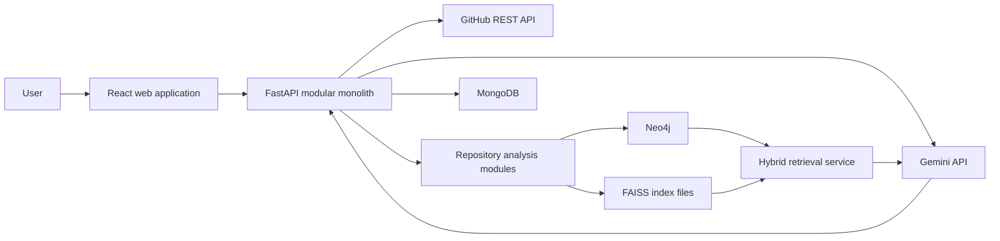

# CodeGraph AI v1.0 Architecture

## 1. Purpose and constraints

CodeGraph AI is a repository-intelligence and pull-request review platform. It ingests a GitHub repository, derives deterministic structural information, builds graph and vector indexes, retrieves relevant repository context, and uses Gemini to produce answers and review reports backed by file, symbol, and line evidence.

This design optimizes for a useful v1 that can be implemented in roughly two weeks:

- Use a modular monolith, not microservices.
- Support Python first. Add JavaScript and TypeScript after the Python path is stable.
- Prefer deterministic analysis over LLM inference.
- Keep Neo4j, FAISS, MongoDB, GitHub, and Gemini behind interfaces.
- Make graph retrieval and vector retrieval independently testable.
- Do not require live external services in unit tests.
- Treat repository content and all LLM output as untrusted.

## 2. System context and overall architecture



The FastAPI application owns orchestration and exposes one versioned API. Internally, modules communicate through typed service interfaces and domain models rather than HTTP. MongoDB stores operational metadata, Neo4j stores structural relationships, and FAISS stores embeddings. Source snapshots are temporary working data; v1 does not attempt to become a source-code hosting system.

Long-running indexing is represented as a job with persisted status in MongoDB. P0 may execute jobs in-process to avoid introducing a queue. This constrains the backend to one worker process for job execution. A durable queue and separate worker are a P1 evolution if reliability or scale requires them.

## 3. Backend module architecture

The backend is one deployable application with explicit module boundaries:

```text
backend/
  api/                 HTTP routes, request/response models, error mapping
  core/                settings, logging, security, shared exceptions
  domain/              service-neutral entities, IDs, spans, job states
  repositories/        repository lifecycle and snapshot coordination
  github/              GitHub REST client and archive/PR adapters
  ingestion/           safe download, extraction, filtering, hashing
  analysis/            language detection, parsers, symbol/call resolution
  graph/               graph port, Neo4j adapter, graph queries
  embeddings/          embedding port, Gemini adapter, batching
  vector/              vector-index port, FAISS adapter and manifests
  retrieval/           graph, vector, and hybrid retrieval
  qa/                  question orchestration and evidence assembly
  reviews/             PR diff analysis, impact analysis, report generation
  persistence/         MongoDB repositories and unit-of-work helpers
  jobs/                job state machine and in-process P0 runner
```

These paths describe intended boundaries, not files to scaffold now. API routes call application services. Application services depend on protocols/interfaces such as `GitHubClient`, `GraphStore`, `VectorIndex`, `EmbeddingProvider`, and `ReasoningProvider`. Concrete adapters are constructed at the application boundary and injected. Domain and parsing logic must not import FastAPI, database clients, or Gemini SDK types.

## 4. Frontend architecture

The React/Vite frontend starts in JavaScript. TypeScript should be adopted only if the team decides the additional setup provides enough value; API schema generation and complex client state would be strong reasons.

Suggested boundaries:

- `pages`: repository setup, indexing status, repository Q&A, and PR review.
- `components`: reusable forms, status indicators, evidence cards, source references, and error states.
- `features`: repository, question, and review-specific state and behavior.
- `services`: one HTTP client layer and endpoint-specific functions.
- `hooks`: polling and reusable asynchronous state where justified.

Use server state directly for P0; do not add a global state library unless shared client state becomes difficult to manage. Every asynchronous view must define loading, empty, success, and error states. Evidence should render as file path, symbol, and line range, with a link to the matching GitHub revision when available.

## 5. Repository ingestion pipeline

Ingestion is a bounded, idempotent pipeline:

1. Accept a GitHub owner/repository identifier and optional ref; do not accept arbitrary clone URLs.
2. Resolve repository metadata and an immutable commit SHA through the GitHub REST API.
3. Create or reuse a snapshot keyed by `repository_id + commit_sha`.
4. Download a source archive through the GitHub adapter into a per-job temporary directory.
5. Safely extract it after rejecting absolute paths, path traversal, unsafe links, excessive file counts, and excessive expanded size.
6. Walk files using deterministic path ordering.
7. Apply configurable ignore rules, supported-language filters, binary detection, per-file limits, and repository-size limits.
8. Hash accepted files and record an ingestion manifest.
9. Parse supported files into the internal representation.
10. Write graph data, embeddings, and the FAISS index for the immutable snapshot.
11. Persist the completed index manifest and atomically mark the snapshot ready.
12. Remove temporary source data according to the retention policy.

Each stage updates a job state: `queued`, `fetching`, `extracting`, `parsing`, `graphing`, `embedding`, `indexing`, `ready`, or `failed`. Re-indexing the same commit should return the existing ready snapshot unless explicitly forced. P1 compares manifests so unchanged files can reuse prior analysis and embeddings.

## 6. Source-code parsing pipeline

P0 parsing uses Python's standard-library `ast` module:

1. Decode text using a controlled fallback policy.
2. Parse the complete Python file with `ast.parse`.
3. Walk the tree to extract modules, classes, functions, async functions, methods, imports, inheritance, and call expressions.
4. Use AST location fields to produce source spans.
5. Construct qualified names from lexical parent scopes.
6. Resolve imports and calls conservatively within the repository.
7. Emit unresolved references with their original text instead of inventing targets.
8. Produce deterministic records sorted by path, span, and stable ID.

Syntax errors are file-level partial failures: record the diagnostic and continue indexing other files. A snapshot is `ready_with_warnings` if usable output exists but some files failed.

JavaScript/TypeScript support is P1 and introduces Tree-sitter behind the same parser interface. It must emit the same language-neutral representation. V1 does not promise complete dynamic call resolution for Python, JavaScript, or TypeScript.

## 7. Internal representation

The analysis layer emits validated, language-neutral records. IDs are deterministic hashes of the immutable snapshot identity plus canonical path and semantic identity.

| Record | Required fields | Responsibility |
|---|---|---|
| `SourceSpan` | `start_line`, `start_column`, `end_line`, `end_column` | One-based line evidence and source boundaries |
| `FileIR` | `id`, `snapshot_id`, `path`, `language`, `content_hash`, `line_count` | Canonical file identity and metadata |
| `SymbolIR` | `id`, `file_id`, `kind`, `name`, `qualified_name`, `span`, `signature`, `parent_symbol_id` | Class, function, method, and other named declaration |
| `ImportIR` | `file_id`, `module`, `imported_name`, `alias`, `span`, `resolved_file_id` | Import statement and optional conservative resolution |
| `CallIR` | `caller_symbol_id`, `callee_text`, `span`, `resolved_symbol_id`, `confidence` | Call site with optional resolved target |
| `InheritanceIR` | `class_symbol_id`, `base_text`, `resolved_symbol_id`, `span` | Base-class reference |
| `CodeChunk` | `id`, `file_id`, `symbol_id`, `kind`, `text`, `span`, `content_hash`, `metadata` | Embedding and evidence retrieval unit |
| `Diagnostic` | `file_id`, `stage`, `code`, `message`, `span`, `severity` | Non-fatal or fatal analysis issue |

`SymbolIR.kind` initially permits `class`, `function`, and `method`. A method's `parent_symbol_id` points to its class. References that cannot be resolved retain text and location but have no target ID. Pydantic models validate records at module and persistence boundaries; internal pure parsing helpers may use typed dataclasses where simpler.

## 8. Neo4j graph model

### Node labels

- `Repository`: stable GitHub repository identity.
- `Snapshot`: immutable commit SHA and indexing status.
- `File`: canonical path and content hash within a snapshot.
- `Class`: qualified name, signature, and source span.
- `Function`: qualified name, signature, and source span.
- `Method`: qualified name, signature, and source span.

### Relationships

- `(Repository)-[:HAS_SNAPSHOT]->(Snapshot)`
- `(Snapshot)-[:CONTAINS]->(File)`
- `(File)-[:DECLARES]->(Class|Function)`
- `(Class)-[:DECLARES]->(Method)`
- `(File)-[:IMPORTS {span, imported_name}]->(File)` when resolved
- `(Class)-[:INHERITS_FROM {span}]->(Class)` when resolved
- `(Function|Method)-[:CALLS {span, confidence}]->(Function|Method)` when resolved

Unresolved imports and calls remain properties in analysis records or diagnostics and are not connected to guessed nodes. Every snapshot-scoped node carries `repository_id` and `snapshot_id`. Uniqueness constraints cover stable IDs; indexes cover repository/snapshot IDs, file paths, and symbol qualified names. Writes are batched and use deterministic `MERGE` keys so retries are idempotent.

P0 impact analysis traverses bounded one- or two-hop relationships around changed files and symbols. It must enforce repository and snapshot predicates in every query to prevent cross-repository leakage.

## 9. MongoDB collections

| Collection | Responsibility |
|---|---|
| `repositories` | GitHub identity, default branch, latest indexed snapshot, timestamps |
| `snapshots` | Commit SHA, ingestion manifest summary, supported languages, status, warnings |
| `indexing_jobs` | Job state, progress, stage timestamps, retry count, sanitized failure |
| `vector_indexes` | FAISS manifest, embedding model/version, dimension, chunk count, file location |
| `questions` | Question, snapshot, retrieval trace IDs, answer status, validated citations |
| `pr_reviews` | PR identity/head/base SHAs, changed-file summary, affected entities, validated report |

Store only metadata needed for operation and traceability. Avoid duplicating the complete graph or raw repository. Large source text belongs only in bounded temporary workspaces and chunk construction; whether selected chunk text is retained must be an explicit retention decision. Add TTL indexes for temporary job details and old question traces if retained.

## 10. FAISS indexing strategy

P0 uses one FAISS index per immutable repository snapshot:

- Embed normalized code chunks with one configured embedding model and version.
- Normalize vectors and use `IndexFlatIP` for cosine-equivalent exact search.
- Maintain an ordered mapping from FAISS integer positions to `chunk_id` and evidence metadata.
- Persist the index and mapping under a snapshot-specific data directory.
- Store dimension, model, chunker version, checksum, and counts in the MongoDB manifest.
- Build into a temporary location, verify counts/checksums, then atomically promote it.
- Never load an index whose manifest does not match its snapshot, embedding model, dimension, and chunker version.

Exact search is intentionally simple and reliable for P0-sized repositories. Approximate indexes, sharding, and remote vector databases are deferred until measurements justify them.

## 11. Code chunking strategy

Prefer semantic chunks over fixed windows:

1. Create one chunk for each class, function, and method including its signature, docstring/comments, and bounded body.
2. Create a file-summary chunk containing path, imports, and top-level declarations.
3. For oversized symbols, split by statement/block boundaries with a small line overlap while preserving the same symbol ID.
4. For remaining top-level code, create bounded line-range chunks.
5. Never merge code from different files into one chunk.

Every chunk retains repository ID, snapshot ID, path, language, symbol ID/name/kind when applicable, exact line range, content hash, and chunker version. Apply configurable token and character caps before embedding. Generated summaries are not required for P0 indexing because they add cost and nondeterminism.

## 12. Hybrid retrieval algorithm

The graph and vector retrievers expose independent interfaces and return a common `EvidenceCandidate` model.

1. Validate and normalize the user query.
2. Extract exact file paths and symbol-like terms using deterministic matching.
3. Embed the query and request top `k_vector` chunks from FAISS.
4. Find exact/partial file and qualified-symbol matches in Neo4j.
5. Expand high-confidence graph seeds through bounded `DECLARES`, `IMPORTS`, `CALLS`, and `INHERITS_FROM` edges.
6. Convert graph results to source-backed evidence candidates.
7. Merge candidates using reciprocal-rank fusion, plus bounded boosts for exact path/symbol matches.
8. Deduplicate by chunk or overlapping source span.
9. Enforce per-file diversity and a total context-token budget.
10. Return the selected evidence and a machine-readable retrieval trace.

P0 uses fixed, tested fusion weights rather than an LLM reranker. Retrieval results must always be filtered by repository and snapshot. Vector-only and graph-only modes remain callable in tests and diagnostics.

## 13. Gemini interaction architecture

Two narrow interfaces isolate the provider:

- `EmbeddingProvider.embed(texts) -> vectors`
- `ReasoningProvider.generate(request) -> raw response`

The Gemini adapter handles authentication, timeouts, bounded retries with jitter for transient errors, batching, rate limits, and provider error translation. Prompts are versioned application assets and receive only the selected repository evidence, not unrestricted filesystem access.

Responses use a defined JSON schema containing an answer/report, findings, confidence or uncertainty, and citation IDs. Raw output is parsed and validated with Pydantic. Citation IDs must resolve to evidence supplied in the request, and claimed file/symbol/line data is reconstructed from server-owned evidence rather than trusted from the model. Invalid output may be repaired once with a constrained retry; otherwise return a controlled failure. LangChain may be used for provider/prompt plumbing if it reduces code. LangGraph is not required for P0's linear flows.

Repository text is data, not instruction. Prompts explicitly delimit it, but security does not rely on prompting alone: tools are not exposed to the model, context is bounded, outputs are schema-validated, and actions are never executed from model output.

## 14. Repository Q&A flow

1. Client submits a question for a ready repository snapshot.
2. API validates length, repository access, snapshot state, and rate limits.
3. Hybrid retrieval selects evidence and records a trace ID.
4. The Q&A service creates a bounded prompt with numbered evidence IDs.
5. Gemini returns structured output referencing only those IDs.
6. The service validates structure and citation membership.
7. The API returns the answer with server-generated evidence objects: path, symbol, start/end lines, commit SHA, and optional GitHub URL.

If retrieval yields insufficient evidence, the response must say so rather than invent an answer. Answers distinguish repository facts from model inference.

## 15. GitHub integration

The GitHub adapter uses the REST API for repository metadata, immutable archive retrieval, commits, pull-request metadata, changed files, and patches. Use conditional requests where useful and observe rate-limit headers.

P0 accepts canonical GitHub owner/repository input and works with public repositories or a server-configured token. Tokens are never accepted in URLs, logged, or returned to clients. Private repositories, OAuth, and GitHub App installation flows are deferred unless explicitly promoted into scope.

PR data is always pinned to base and head SHAs. Patch text from GitHub can be truncated; when necessary, compare safely obtained base/head file content within configured limits. Webhooks are not required in P0; reviews are requested explicitly by PR number.

## 16. Pull-request review pipeline

1. Fetch PR metadata, base/head SHAs, changed files, statuses, and available patches.
2. Validate repository identity and enforce file, byte, and change-count limits.
3. Ensure the base snapshot is indexed; report a pending/precondition state otherwise.
4. Parse changed Python files from the head revision and map diff hunks to symbols.
5. Derive deterministic change facts: added/modified/deleted symbols, changed imports, and changed calls where resolvable.
6. Traverse the base graph from changed files/symbols to bounded dependents and callers.
7. Retrieve semantically related code and existing structural context.
8. Assemble evidence for risks, affected components, and suggested checks.
9. Ask Gemini for a structured review report.
10. Validate every finding and citation against the supplied diff/context evidence.
11. Persist and return the report; do not post to GitHub automatically in P0.

The report separates deterministic impact candidates from model-generated observations. P0 reviews Python changes and flags unsupported-language files without pretending to analyze them structurally.

## 17. API endpoints

All endpoints are under `/api/v1` and use JSON unless returning health status.

| Method and path | Purpose | Typical response |
|---|---|---|
| `GET /health/live` | Process liveness | `200` |
| `GET /health/ready` | Required dependency readiness | `200` or `503` |
| `POST /repositories` | Register canonical GitHub repository | `201` |
| `GET /repositories/{repository_id}` | Repository and latest snapshot status | `200` |
| `POST /repositories/{repository_id}/index-jobs` | Index a ref/commit idempotently | `202` |
| `GET /index-jobs/{job_id}` | Poll stage, progress, warnings, failure | `200` |
| `POST /repositories/{repository_id}/questions` | Ask against a ready snapshot | `200` |
| `POST /repositories/{repository_id}/pull-requests/{number}/reviews` | Start PR review | `202` |
| `GET /pr-reviews/{review_id}` | Poll or retrieve validated review | `200` |

Use Pydantic request and response models, opaque IDs, explicit maximum lengths, and a consistent error envelope. Pagination is required for list endpoints when introduced.

## 18. Error-handling strategy

Define typed application errors and translate them once at the API boundary. The error envelope contains `code`, safe `message`, `request_id`, and optional validated details.

- `400/422`: malformed or unsupported input.
- `404`: unknown repository, snapshot, job, or review.
- `409`: conflicting state or duplicate operation that cannot be reused.
- `413`: repository, file, diff, or prompt exceeds a configured bound.
- `429`: local or provider rate limiting.
- `502/503/504`: sanitized external dependency failure or timeout.

Jobs persist a stable failure code and sanitized summary while detailed stack traces remain in server logs. A file parse failure should not fail an otherwise useful snapshot; corrupt manifests, graph/index write failures, and identity mismatches must fail the job. Retries are limited to idempotent operations and transient failures.

## 19. Logging strategy

Use structured application logs with timestamp, severity, event name, request/job ID, repository ID, snapshot ID, stage, duration, and sanitized error code. Carry correlation IDs from HTTP requests into jobs and provider calls.

Never log tokens, authorization headers, repository archive contents, raw prompts, raw model responses, full source chunks, or sensitive URLs. Log counts, hashes, model names, token usage, and timings where useful. Development may use readable console formatting; deployed environments use JSON. P0 does not require a separate observability stack.

## 20. Testing architecture

Tests mirror module boundaries:

- Unit tests: stable IDs, safe extraction, filtering, Python AST fixtures, qualified names, spans, chunking, fusion, prompt construction, schema validation, and error mapping.
- Contract tests: fake implementations must satisfy the same graph, vector, GitHub, embedding, and reasoning interfaces as real adapters.
- Adapter integration tests: Neo4j and MongoDB tests run against disposable containers; FAISS tests use temporary directories; provider adapters use recorded shapes or mocked HTTP, never real credentials in CI.
- API tests: FastAPI test client with injected fakes verifies success, error, job, Q&A, and review flows.
- Frontend tests: critical components and API-state behavior, plus one mocked end-to-end happy path if time permits.

Use small repository fixtures with known file/symbol/line expectations. Golden outputs are appropriate for deterministic IR and evidence assembly, but model prose should not be asserted verbatim. Unit tests must not require Gemini, GitHub, Neo4j, or MongoDB connectivity.

## 21. Docker architecture

Docker Compose is the local orchestration boundary:

- `backend`: FastAPI application and P0 in-process jobs.
- `frontend`: Vite development server locally; static build served separately in deployment.
- `neo4j`: graph database with a persistent named volume and health check.
- `mongodb`: metadata store with a persistent named volume and health check.

FAISS indexes use a backend-mounted data volume. Temporary repository workspaces use a separate bounded directory/volume and are deleted after indexing. Services communicate on an internal network; only necessary development ports are published. Credentials come from runtime environment injection, not committed Compose values. No separate queue or worker is introduced in P0.

## 22. CI pipeline

GitHub Actions runs on pull requests and protected-branch updates:

1. Check that dependency lockfiles are consistent once they exist.
2. Backend formatting and lint checks.
3. Backend type checks.
4. Backend unit and API tests.
5. Frontend formatting/lint checks and tests.
6. Frontend production build.
7. Container build validation.
8. Optional adapter integration job using service containers.

Pin action versions, use least-privilege workflow permissions, cache only safe dependency data, and never run untrusted PR code with repository secrets. P0 can make deterministic unit/API tests blocking and keep slower container integration tests as a separate job until stable.

## 23. Deployment architecture

P0 targets local Docker Compose. A simple hosted v1 can use one frontend static host, one backend container, managed or dedicated Neo4j and MongoDB, and persistent object/block storage for FAISS indexes. Keep the backend to one job-executing process until a durable queue exists.

Scale later by separating API and workers, placing snapshots/indexes in shared storage, and adding a durable queue. This is an evolution of adapter boundaries, not a rewrite into microservices. Deploy immutable images, run database migrations/constraints explicitly, expose liveness/readiness checks, and support rollback to the previous image.

## 24. Secrets management

Secrets include Gemini keys, GitHub tokens, database credentials, and signing keys. Inject them at runtime through local uncommitted environment configuration and a deployment secret manager. Commit only documented variable names and safe examples with placeholder values when configuration work begins.

Fail fast when required secrets are missing, redact known secret fields in logs/errors, scope GitHub credentials to minimum permissions, rotate credentials, and use separate development/CI/production values. CI secrets must not be available to workflows triggered from untrusted forks.

## 25. Security boundaries

- **Client to API:** validate identifiers, sizes, pagination, authorization when introduced, and rate limits.
- **API to GitHub:** allow only supported GitHub hosts and canonical owner/repository identifiers; prevent SSRF and credential leakage.
- **Archive to workspace:** prevent zip-slip, unsafe links, device files, decompression bombs, oversized repositories, and cross-job paths.
- **Repository to parser:** treat source as hostile data; do not import, execute, build, or run analyzed code.
- **Repository to LLM:** delimit and minimize context; repository instructions have no authority.
- **LLM to application:** validate schemas and evidence references; never execute model-generated commands or mutations.
- **Application to data stores:** scope every query by repository and snapshot; use separate credentials and least privilege.
- **PR review to GitHub:** P0 is read-only and never posts comments or changes repository state.

P0 should be explicit about being a local/single-user system if authentication is not implemented. It must not be exposed publicly without an authentication and authorization design.

## 26. Performance considerations

- Bound repository files, total expanded bytes, individual file size, diff size, chunk count, prompt tokens, and graph traversal depth.
- Stream downloads and hash files without loading the full repository into memory.
- Parse in deterministic bounded parallel batches only after correctness is established.
- Batch Neo4j writes and embedding calls.
- Cache by immutable commit SHA, file content hash, chunker version, and embedding model version.
- Use exact FAISS search first; measure before adopting approximate search.
- Select evidence within a strict context budget and limit repeated chunks from one file.
- Track stage durations, file/chunk counts, external-call latency, token usage, and failure rates.
- Add incremental manifest comparison in P1 to avoid reprocessing unchanged files.

## 27. Important architectural decisions

| Decision | Choice | Reasoning and trade-off |
|---|---|---|
| Backend shape | Modular monolith | Fast to build and test; module interfaces preserve a path to later separation without microservice overhead |
| P0 language | Python via standard `ast` | Deterministic, no parser dependency, and achievable; JavaScript/TypeScript via Tree-sitter follows in P1 |
| Job execution | Persisted jobs with an in-process runner | Avoids a queue in P0; accepts single-process and restart-recovery limitations |
| Source acquisition | GitHub REST metadata and archives | Avoids executing Git commands against untrusted input and pins analysis to a commit SHA |
| Structural store | Neo4j | Natural bounded traversal for dependencies and impact candidates |
| Vector store | Per-snapshot FAISS `IndexFlatIP` | Simple, exact, locally testable, and sufficient before scale data exists |
| Operational store | MongoDB | Flexible job, repository, review, and manifest documents |
| Retrieval | Deterministic reciprocal-rank fusion | Independently testable and debuggable; avoids an additional LLM reranking call |
| Model integration | Replaceable embedding/reasoning ports | Limits vendor coupling and makes unit testing independent of Gemini |
| LLM output | Pydantic-validated structured responses | Prevents model output from becoming trusted application state |
| Evidence | Server-owned citation IDs and source spans | Prevents fabricated model citations and makes answers auditable |
| Orchestration | Plain application services in P0 | The flows are linear; LangGraph is deferred until branching/state complexity justifies it |
| PR behavior | Generate reports without posting | Keeps GitHub integration read-only and reduces permission/security scope |
| Local databases | Docker Compose services | Reproducible development without requiring local Neo4j or MongoDB installations |

## 28. Complexity review

The P0 architecture deliberately excludes a message broker, microservices, Kubernetes, an approximate vector index, an LLM reranker, automatic GitHub comments, broad language support, and production multi-tenancy. The main unavoidable complexity is maintaining consistent snapshot identity and evidence across MongoDB, Neo4j, and FAISS. Deterministic IDs, immutable snapshots, manifests, bounded workflows, and adapter contracts address that risk without adding infrastructure.

The complete product direction is larger than two weeks, so the P0 implementation must follow the narrower acceptance boundary in `V1_SCOPE.md`. P1 and P2 capabilities must not delay the P0 vertical slice.
